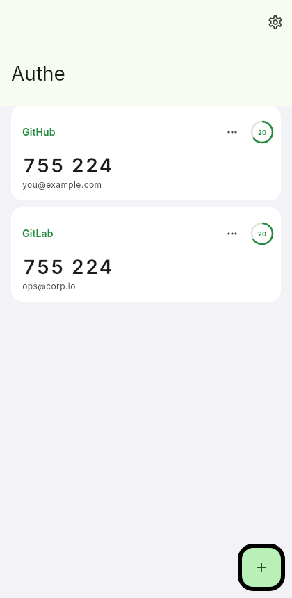

# Authe

Open two-factor authentication for every screen you own.

Authe generates TOTP codes (RFC 6238) on Android, iOS, macOS, Windows and Linux. Secrets never leave your device: they are stored in the platform secure enclave (Keychain on Apple platforms, Keystore on Android, libsecret on Linux, DPAPI on Windows).



## Features

- Scan the setup QR code, paste an `otpauth://` link, or enter the key manually
- SHA-1 / SHA-256 / SHA-512, 6 or 8 digits, custom periods
- One tap copies the current code
- Adapts between phone and desktop layouts on a single shared state
- Light, dark and system themes

## Get Authe

Prebuilt packages are attached to every [release](https://gitlab.com/HttpAnimations/authe/-/releases):

| Platform | Package |
| --- | --- |
| iOS | `authe-ios-arm64-unsigned.ipa` (via the AltStore source below) |
| Android | `authe-android.apk` |
| macOS (Apple Silicon) | `authe-macos-arm64.dmg` |
| Windows (x86_64) | `authe-windows-x86_64.zip` |
| Linux (x86_64 + arm64) | AppImage, `.deb`, `.rpm`, `.tar.gz` |

The web build is a landing page only, hosted on GitLab Pages — an authenticator does not belong in a browser.

### AltStore

Add the Authe source to AltStore or SideStore:

```
https://httpanimations.gitlab.io/authe/altstore/apps.json
```

## Development

```bash
flutter pub get
flutter run            # native app
flutter test --coverage
flutter analyze
```

Commits use [Conventional Commits](https://www.conventionalcommits.org) and are checked by [cocogitto](https://github.com/cocogitto/cocogitto); releases are cut automatically by CI with `cog bump`.

The release pipeline runs on GitLab, builds every platform on GitHub Actions, then mirrors the binaries back to GitLab releases so they never expire.

## License

GNU AGPL v3. See [LICENSE](LICENSE).
